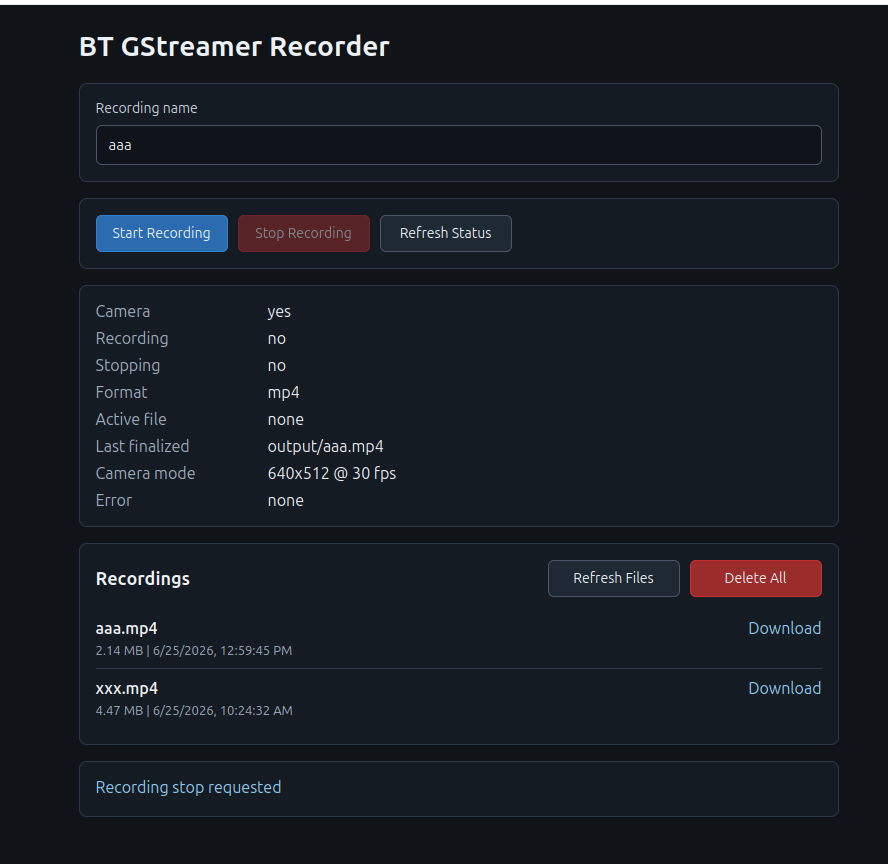
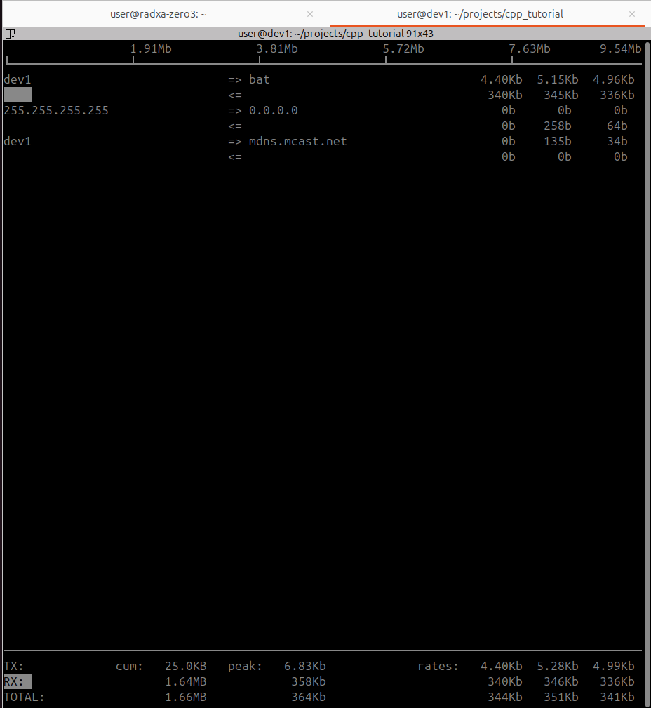

# Bt_record

Run gstreamer pipe that capture the camera and stream the video
Allow to attach record branch that save the stream from the camera to local path

The application and simple web site with single html file that allow to manage save videos

- start
- stop
- download
- status
- remove remote files

!!! Note

The idea of this project is the to allow record (raw/mp4) , the encoding control and streaming is out off scope


## Build
using uv to build the project as whl file
The `whl` locate in dist folder

```bash
uv build
```

## Install

```bash title="install gstreamer"
sudo apt install -y \
  python3-gi \
  python3-gst-1.0 \
  gir1.2-gstreamer-1.0 \
  gir1.2-gst-plugins-base-1.0 \
  gstreamer1.0-tools \
  gstreamer1.0-plugins-base \
  gstreamer1.0-plugins-good \
  gstreamer1.0-plugins-bad \
  gstreamer1.0-plugins-ugly
```

```bash title="install apt dependencies"

sudo apt install -y \
  pkg-config \
  libcairo2-dev \
  libgirepository-2.0-dev \
  gobject-introspection \
  python3-dev \
  build-essential
```
```bash
# install uv from internet
curl -LsSf https://astral.sh/uv/install.sh | sh
# add automatic to /.bashrc
source $HOME/.local/bin/env
```


## usage

```
uv run bt-gst-record run
uv run bt-gst-record run -c config.yaml
```

## cli commands

| command | description |
|---|---|
| `uv run bt-gst-record run` | Start the recorder HTTP service and camera pipeline. |
| `uv run bt-gst-record version` | Print the installed package version. |
| `uv run bt-gst-record dump_config` | Print the effective config as YAML after defaults, config file, and CLI overrides. |
| `uv run bt-gst-record dump_pipe` | Print the live GStreamer camera-to-UDP pipeline. |
| `uv run bt-gst-record dump_receiver_pipe` | Print a runnable receiver GStreamer command for the UDP stream. |
| `uv run bt-gst-record dump_device_formats` | Print camera device formats using `v4l2-ctl`. |
| `uv run bt-gst-record test` | Run a synthetic `videotestsrc` streaming pipeline without requiring a camera device. |

Control config from the CLI:

| option | description |
|---|---|
| `-c, --config PATH` | Load recorder settings from a YAML config file. |
| `--stream-ip IP` | Set the UDP stream destination IP address. |
| `--stream-ip-port PORT` | Set the UDP stream destination port. |
| `--device PATH` | Set the camera device path. |
| `--width WIDTH` | Set the camera capture width. |
| `--height HEIGHT` | Set the camera capture height. |
| `--fps FPS` | Set the camera frames per second. |
| `--record-format {mp4,raw}` | Set the recording output format. |
| `--video-format FORMAT` | Set the camera raw video format, for example `YUY2` or `NV12`. |
| `--http-server-port PORT` | Set the HTTP server port. |
| `--target-folder PATH` | Set the recording output folder. |


### TIP
Create config.yaml

```bash
uv run bt-gst-record dump_config > config.yaml
```

### Web




###

```bash title="test video src
gst-launch-1.0 v4l2src name=camera \
  ! video/x-raw,format=I420,width=640,height=512,framerate=30/1 \
  ! videoconvert \
  ! autovideosink
```

### Receiver pipe
```
gst-launch-1.0 -v \
  udpsrc port=5600 caps="application/x-rtp,media=video,encoding-name=H264,payload=96,clock-rate=90000" ! \
  rtph264depay ! \
  h264parse ! \
  avdec_h264 ! \
  videoconvert ! \
  autovideosink sync=false
```


### play

#### Play raw format

```
gst-launch-1.0 -v \
  filesrc location=recording.i420 ! \
  rawvideoparse format=i420 width=640 height=512 framerate=30/1 ! \
  videoconvert ! \
  autovideosink
```

---

## prod

```
uv run bt-gst-record --help
```

```
uv run bt-gst-record dump_device_formats
```

```
uv run bt-gst-record dump_config
uv run bt-gst-record dump_config > bat_config/video.yaml

```

```
uv run bt-gst-record run -c bat_config/video.yaml
```


```
gst-launch-1.0 v4l2src name=camera --device /dev/video4 \
            ! video/x-raw,format=YUY2,width=640,height=512,framerate=30/1 \
            ! videoconvert ! fakesink
```


```
gst-launch-1.0 -v udpsrc port=5600 caps="application/x-rtp,media=video,encoding-name=H264,payload=96,clock-rate=90000" \
            ! rtph264depay \
            ! h264parse \
            ! avdec_h264 \
            ! videoconvert \
            ! fpsdisplaysink video-sink=autovideosink sync=false text-overlay=true

```

